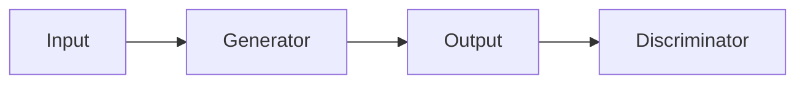

# Documentation Maintenance Guide

This guide explains how to maintain and update the ECGEN documentation.

## Overview

ECGEN uses **MkDocs** with the **Material theme** for documentation. The documentation is:

- Written in Markdown
- Automatically deployed to GitHub Pages
- Includes auto-generated API reference
- Searchable and mobile-friendly

## Documentation Structure

```
ECGEN/
├── docs/                          # Documentation source files
│   ├── index.md                   # Homepage
│   ├── getting-started/           # Getting started guides
│   │   ├── installation.md
│   │   └── quickstart.md
│   ├── user-guide/                # User guides
│   │   ├── pulse2pulse/
│   │   │   ├── overview.md
│   │   │   ├── training.md
│   │   │   └── configuration.md
│   │   └── wandb.md
│   ├── reference/                 # API reference (auto-generated)
│   │   └── index.md
│   ├── development/               # Development docs
│   │   ├── contributing.md
│   │   └── changelog.md
│   └── gen_ref_pages.py          # API doc generator script
├── mkdocs.yml                     # MkDocs configuration
└── .github/workflows/docs.yml     # Auto-deployment workflow
```

## Quick Start

### Install Documentation Dependencies

```bash
pip install -e ".[docs]"
```

This installs:
- `mkdocs` - Documentation generator
- `mkdocs-material` - Material theme
- `mkdocstrings` - API documentation generator
- `mkdocs-gen-files` - Dynamic file generation
- `mkdocs-literate-nav` - Navigation generation
- `mkdocs-section-index` - Section index pages

### Serve Documentation Locally

```bash
# Start local server
mkdocs serve

# Open http://127.0.0.1:8000 in your browser
```

The server will auto-reload when you save changes.

### Build Documentation

```bash
# Build static site
mkdocs build

# Output is in site/ directory
```

### Deploy to GitHub Pages

```bash
# Manual deployment
mkdocs gh-deploy

# Or push to main/master branch (automatic via GitHub Actions)
git push origin main
```

## Common Tasks

### 1. Add a New Page

#### Step 1: Create the Markdown file

```bash
# Example: Add a new guide
touch docs/user-guide/new-guide.md
```

#### Step 2: Add content

```markdown
# New Guide Title

Introduction paragraph.

## Section 1

Content here.

## Section 2

More content.
```

#### Step 3: Add to navigation

Edit `mkdocs.yml`:

```yaml
nav:
  - Home: index.md
  - User Guide:
    - New Guide: user-guide/new-guide.md  # Add this line
```

#### Step 4: Preview

```bash
mkdocs serve
```

### 2. Update Existing Page

Simply edit the Markdown file and save. The local server will auto-reload.

```bash
# Edit a file
vim docs/getting-started/installation.md

# Preview changes
mkdocs serve
```

### 3. Add Code Examples

Use fenced code blocks with syntax highlighting:

````markdown
```python
from ecgen.models.pulse2pulse import Pulse2PulseGAN

model = Pulse2PulseGAN(config)
```
````

### 4. Add Admonitions (Callouts)

```markdown
!!! note
    This is a note.

!!! warning
    This is a warning.

!!! tip
    This is a tip.

!!! danger
    This is dangerous!
```

### 5. Add Tabbed Content

```markdown
=== "Tab 1"
    Content for tab 1

=== "Tab 2"
    Content for tab 2
```

### 6. Add Diagrams (Mermaid)

````markdown

````

### 7. Update API Documentation

API documentation is auto-generated from docstrings. To update:

1. **Update docstrings** in Python code:

```python
def my_function(param1: int, param2: str) -> bool:
    """Brief description.
    
    Longer description if needed.
    
    Args:
        param1: Description of param1
        param2: Description of param2
        
    Returns:
        Description of return value
        
    Examples:
        >>> my_function(42, "hello")
        True
    """
    return True
```

2. **Rebuild documentation**:

```bash
mkdocs serve  # API docs regenerate automatically
```

### 8. Update Navigation

Edit `mkdocs.yml`:

```yaml
nav:
  - Home: index.md
  - Getting Started:
    - Installation: getting-started/installation.md
    - Quick Start: getting-started/quickstart.md
  - User Guide:
    - Pulse2Pulse:
      - Overview: user-guide/pulse2pulse/overview.md
      - Training: user-guide/pulse2pulse/training.md
```

### 9. Update Changelog

Edit `docs/development/changelog.md`:

```markdown
## [0.2.0] - 2024-03-01

### Added
- New feature X
- New feature Y

### Fixed
- Bug fix Z
```

### 10. Add Images

```bash
# Create images directory
mkdir -p docs/assets/images

# Add image
cp image.png docs/assets/images/

# Reference in markdown

```

## Configuration

### MkDocs Configuration (`mkdocs.yml`)

Key sections:

#### Site Information
```yaml
site_name: ECGEN Documentation
site_description: ECG Generation and Modeling Experiments
site_url: https://yourusername.github.io/ECGEN
repo_url: https://github.com/yourusername/ECGEN
```

#### Theme Configuration
```yaml
theme:
  name: material
  palette:
    - scheme: default  # Light mode
    - scheme: slate    # Dark mode
  features:
    - navigation.tabs
    - search.suggest
    - content.code.copy
```

#### Plugins
```yaml
plugins:
  - search              # Search functionality
  - mkdocstrings        # API documentation
  - gen-files           # Generate API reference
```

#### Markdown Extensions
```yaml
markdown_extensions:
  - pymdownx.highlight  # Code highlighting
  - pymdownx.superfences # Fenced code blocks
  - admonition          # Callouts
  - tables              # Tables
```

## GitHub Actions Deployment

### How It Works

1. Push to `main` or `master` branch
2. GitHub Actions workflow triggers
3. Documentation is built
4. Deployed to `gh-pages` branch
5. Available at `https://yourusername.github.io/ECGEN`

### Workflow File (`.github/workflows/docs.yml`)

```yaml
name: Deploy Documentation

on:
  push:
    branches: [main, master]

jobs:
  deploy:
    runs-on: ubuntu-latest
    steps:
      - uses: actions/checkout@v4
      - uses: actions/setup-python@v5
      - run: pip install -e ".[docs]"
      - run: mkdocs gh-deploy --force
```

### Enable GitHub Pages

1. Go to repository Settings
2. Navigate to Pages
3. Source: Deploy from branch
4. Branch: `gh-pages`
5. Folder: `/ (root)`
6. Save

### Custom Domain (Optional)

1. Add `CNAME` file to `docs/`:
```bash
echo "docs.yourdomain.com" > docs/CNAME
```

2. Configure DNS:
```
CNAME docs.yourdomain.com -> yourusername.github.io
```

## Best Practices

### Writing Documentation

1. **Be Clear and Concise**
   - Use simple language
   - Short paragraphs
   - Clear headings

2. **Include Examples**
   - Show code examples
   - Provide command-line examples
   - Include expected output

3. **Use Consistent Style**
   - Follow existing formatting
   - Use same heading levels
   - Consistent terminology

4. **Keep It Updated**
   - Update docs with code changes
   - Remove outdated information
   - Update version numbers

5. **Test Everything**
   - Test all code examples
   - Verify all links work
   - Check on mobile devices

### Organizing Content

1. **Logical Structure**
   - Group related content
   - Progressive complexity
   - Clear navigation

2. **Cross-Reference**
   - Link related pages
   - Reference API docs
   - Point to examples

3. **Search Optimization**
   - Use descriptive titles
   - Include keywords
   - Clear section headings

### API Documentation

1. **Complete Docstrings**
   - All public functions
   - All parameters documented
   - Return values explained

2. **Type Hints**
   - Use type hints everywhere
   - Import from `typing`
   - Document complex types

3. **Examples in Docstrings**
   - Show typical usage
   - Include edge cases
   - Demonstrate best practices

## Troubleshooting

### Documentation Not Building

**Problem**: `mkdocs build` fails

**Solutions**:
```bash
# Check for syntax errors
mkdocs build --verbose

# Verify dependencies
pip install -e ".[docs]"

# Check mkdocs.yml syntax
python -c "import yaml; yaml.safe_load(open('mkdocs.yml'))"
```

### Links Not Working

**Problem**: Broken internal links

**Solutions**:
- Use relative paths: `[Link](../other-page.md)`
- Check file exists: `ls docs/path/to/file.md`
- Use lowercase and hyphens in filenames

### API Docs Not Generating

**Problem**: API reference pages empty

**Solutions**:
```bash
# Check gen_ref_pages.py
python docs/gen_ref_pages.py

# Verify source code has docstrings
grep -r "def " src/ecgen/

# Rebuild
mkdocs build --clean
```

### GitHub Pages Not Updating

**Problem**: Changes not visible on GitHub Pages

**Solutions**:
1. Check GitHub Actions: Repository → Actions
2. Verify gh-pages branch exists: Repository → Branches
3. Check Pages settings: Repository → Settings → Pages
4. Clear browser cache
5. Wait 5-10 minutes for propagation

### Search Not Working

**Problem**: Search returns no results

**Solutions**:
```bash
# Rebuild search index
mkdocs build --clean

# Check search plugin enabled in mkdocs.yml
grep -A 2 "plugins:" mkdocs.yml
```

## Maintenance Checklist

### Weekly
- [ ] Check for broken links
- [ ] Review open documentation issues
- [ ] Update changelog for new features

### Monthly
- [ ] Review and update getting started guides
- [ ] Check all code examples still work
- [ ] Update screenshots if UI changed
- [ ] Review API documentation completeness

### Per Release
- [ ] Update version numbers
- [ ] Update changelog
- [ ] Review all documentation for accuracy
- [ ] Test all examples
- [ ] Update installation instructions if needed

## Resources

- **MkDocs**: https://www.mkdocs.org/
- **Material Theme**: https://squidfunk.github.io/mkdocs-material/
- **Mkdocstrings**: https://mkdocstrings.github.io/
- **Markdown Guide**: https://www.markdownguide.org/

## Getting Help

- **MkDocs Issues**: https://github.com/mkdocs/mkdocs/issues
- **Material Theme Issues**: https://github.com/squidfunk/mkdocs-material/issues
- **ECGEN Issues**: https://github.com/yourusername/ECGEN/issues

---

**Questions?** Open an issue or check the [Contributing Guide](docs/development/contributing.md).
